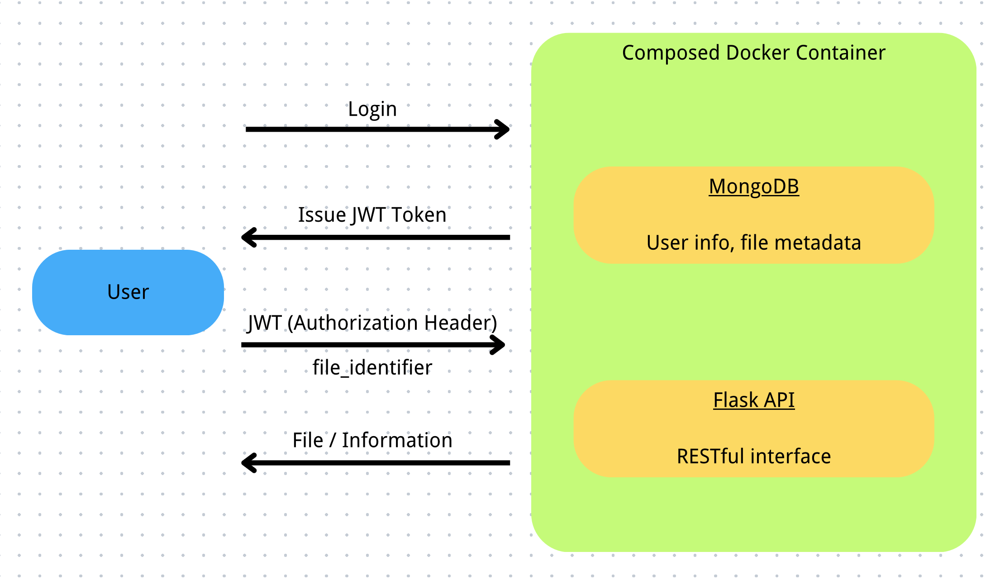

# min-object-storage
 A minimum implementation practice for a backend storage system

## Basic implementations
The implementation is a pure backend without frontend UI and purely accessed using RESTful APIs.

Files are saved to the server with a unique ID (similar to the object storage system like AWS S3). The metadata of the file is stored in a MongoDB database.
- Flask-based API with Gunicorn server
- MongoDB metadata and user database
- Authentication and access control with JWT

## Workflow plot


## Run the server

> [!IMPORTANT]
>
> The JWT token is required for restricted access endpoints. In this implementation,
> after getting the JWT token, modify the header's `Authorization` field with 
> `Bearer <your_JWT_token>`.

> [!IMPORTANT]
>
> The server is running on HTTP for the sake of simplicity. 
> It is recommended to run the server on HTTPS in a production environment. 
> Also, ensure that you are using HTTP when you are testing with tools like `HTTPie`.

1. Install docker from [here](https://docs.docker.com/get-docker/)
2. Clone the repository and `cd` to the directory
3. Run docker-compose
```bash
docker-compose up --build
```
4. Visit the APIs with `curl` or `HTTPie`.

## Endpoints
### `/users`
Deals with user registration and login, distribution of credentials.
- `POST /users/register`: Register a new user.
- `POST /users/login`: Login with username and password. The system will return a JWT token.

### `/data`
Deals with file upload, download, and identifier retrieval.
- `POST /data/file`: Upload a file, specifying your own identifier and metadata. Submit the information in a multipart form.
  - `file`: The file to upload.
  - `file_identifier`: The identifier of the file.
  - Other parts of the form will be treated as metadata.
- `GET /data/file/<file_identifier>`: Download a file with the identifier.
- `GET /data/user_file`: Get all the identifiers of the files you uploaded.
- `GET /data/metadata/<file_identifier>`: Get the metadata of the file with the identifier.
- `DELETE /data/file/<file_identifier>`: Delete the file with the identifier.
